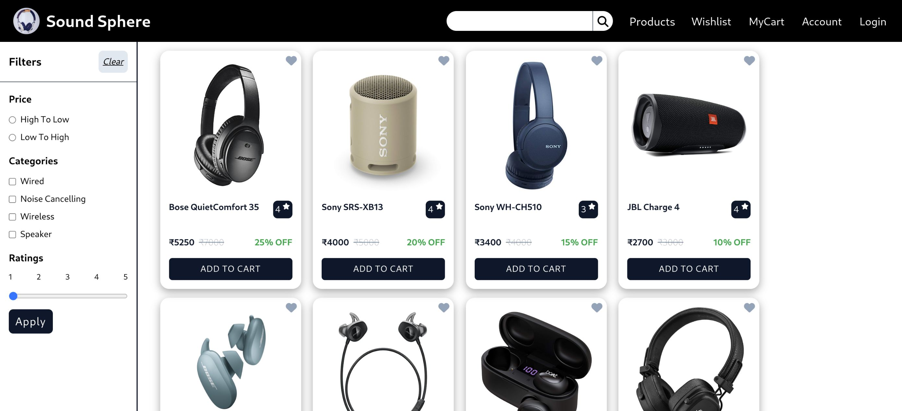

# 🎧 Sound Sphere

This is a frontend-only ecommerce e-commerce application which provides a seamless and interactive user experience for browsing and purchasing products. It primarily focuses on product listing, cart management, and wishlist management. It replicates core features in e-commerce platforms like Amazon or Flipkart, showcasing how products are displayed and managed withing a shopping cart and wishlist, and how basic level of product search works.

## 🌟 Features

- **Product Listing:** Displays a variety of headphones, ear dopes, and speakers.
- **Product Browsing:** Browse through various product categories and view detailed information about each product.
- **Search:** Search for products using the search bar.
- **Filtering and Sorting:** Filter products based on categories, ratings, and sort by price.  
- **Cart Management:** Allows users to add, remove, and view items in the cart.
- **Wishlist Management:** Allows users to add, remove, and view items in wishlist.

## 🛠️ Technologies Used

- Vite + React
- React Router DOM
- Tailwind CSS 🌈
- Context API

## 🖼️ Screenshots

## 🎉 Credits

This project was created as a task given by my friend. Thanks to my friend for providing the task and for encouragement and for always pushing me to achieve my best.

## 📬 Feedback and Suggestions

Your feedback is valuable! If you have any suggestions, ideas, or improvements for this project, please feel free to open an issue or submit a pull request. Your contributions are welcomed and appreciated 🚀.