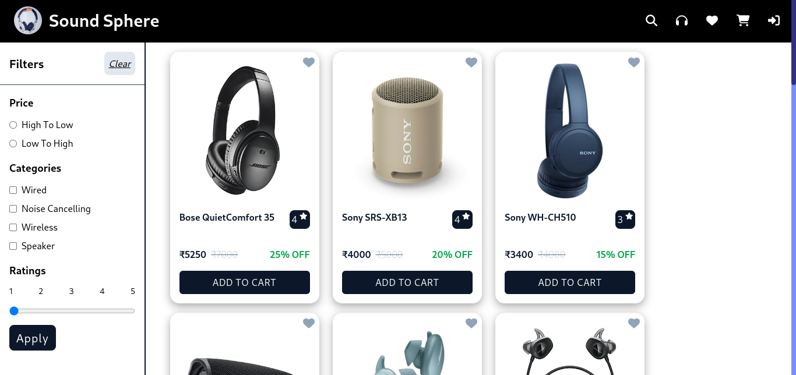

# 🎧 Sound Sphere

Sound Sphere is a full-stack e-commerce application that provides a seamless, interactive experience for browsing and purchasing audio products. The frontend offers an intuitive interface for product browsing, while the backend manages data and user authentication securely. The project is structured to replicate core e-commerce features seen on platforms like Amazon or Flipkart, showcasing product listings, shopping cart functionality, and wishlist management.

## 🌟 Features

- **User Authentication:** Secure login and registration system using JWT (JSON Web Tokens) for authentication and authorization, with both access and refresh tokens.
- **Password Security**: User passwords are securely hashed using bcrypt.
- **Product Listing:** Displays a variety of headphones, ear dopes, and speakers.
- **Product Browsing:** Browse through various product categories and view detailed information about each product.
- **Search:** Search for products using the search bar.
- **Filtering and Sorting:** Filter products based on categories, ratings, and sort by price.  
- **Cart Management:** Allows users to add, remove, and view items in the cart.
- **Wishlist Management:** Allows users to add, remove, and view items in wishlist.

## 🛠️ Technologies Used

- Vite + React
- React Router DOM
- Redux Toolkit
- Tailwind CSS 🌈
- Node.js with Express
- MongoDB for the database
- JWT for user authentication (access and refresh tokens)
- bcrypt for password hashing

The backend code is hosted in a separate repository, available here: [Backend Repository](https://github.com/Aayush259/E-commerce-backend)

## 🖼️ Screenshots

## 🎉 Credits

This project was created as a task given by my friend. Thanks to my friend for providing the task and for encouragement and for always pushing me to achieve my best.

## 📬 Feedback and Suggestions

Your feedback is valuable! If you have any suggestions, ideas, or improvements for this project, please feel free to open an issue or submit a pull request. Your contributions are welcomed and appreciated 🚀.